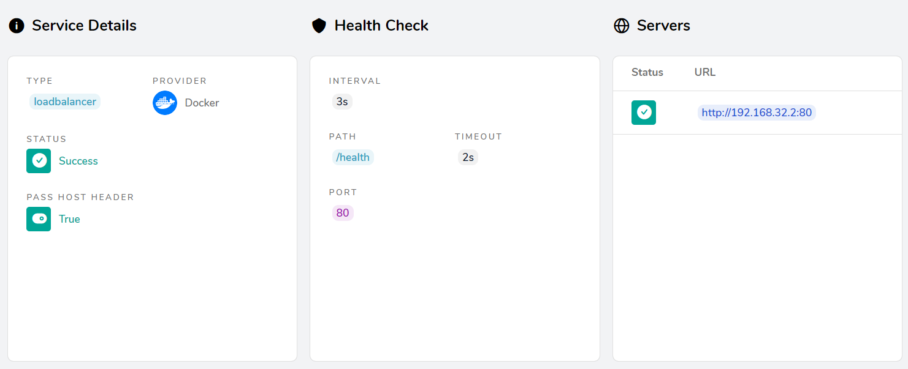
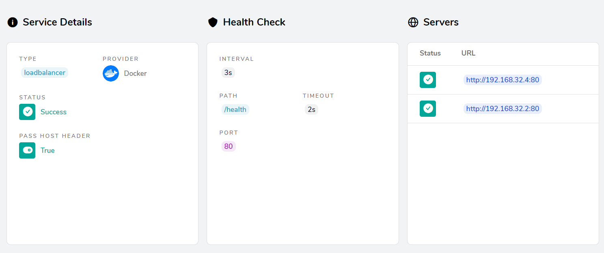
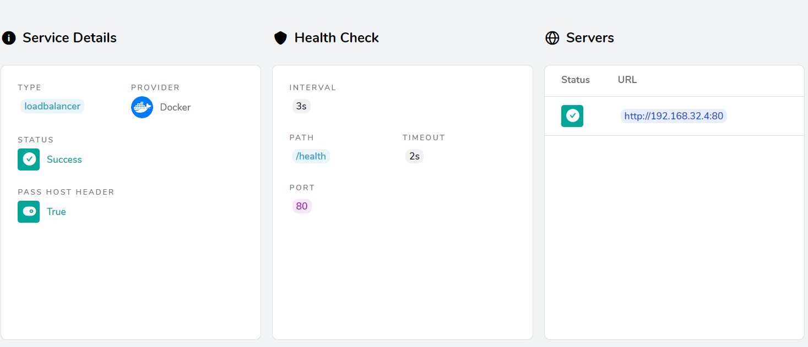
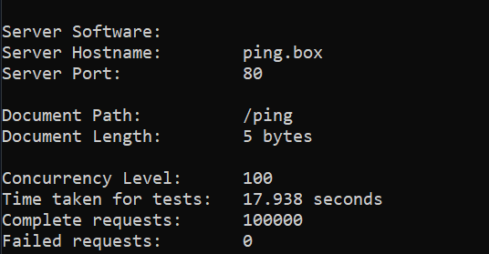

# green-blue-compose
Simple way to realize green/blue deployment with traefik &amp; docker-compose.

Schema of work:
 - traefik proxies requests to containers and provide load balancer
 - we have two versions of same container "green" and "blue" in one docker-compose.yaml and run only one of them in same time

When we deploy new version:

just run `make blue` or `make green` after `make build`

What is happen then?

- we starting opposite color container (blue or green it depends wich one already working)
- traefik load balancer split incoming traffic to both runned containers at this time
- stopping old container (docker sends terminate signal to it)
- container app state changing to "unhealthy" - and it returns error on /health endpoint
- traefik see unhealthy old container and remove it from traffik routing schema (but not closes already opened connections)
- app shutdown it http server (and wait opened connections)
- app closed and containers goes to stopped
- we remove old container
- everyone is happy, going to have smoothie

## How to check
Firstly you should add hosts to your hosts file.
```
127.0.0.1 traefik.box ping.box
```
After that you will be able to see traefik panel on traefik.box.

Green state:


Blue deploy run.
```shell
make blue
```

Rolling update:


Blue state:


AB test due deploy:

`ab -n 100000 -c 100 ping.box/ping`

